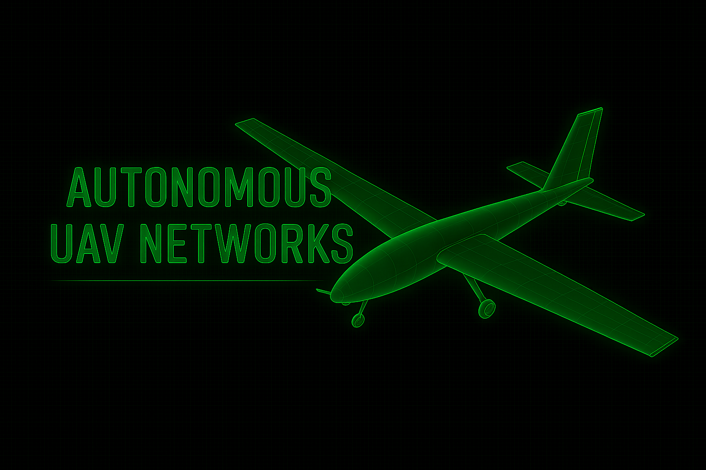

<p align="center">
  
</p>


# 🛰️ Autonomous UAV Networks Simulator (Aerospace-Accurate Edition)

> **High-Fidelity Simulation of Autonomous UAV Mesh Networks**  
> Built for aerospace-grade research, education, and AI-driven network resilience modeling.  
> Inspired by *Sarkar & Gul (2023), “Artificial Intelligence-Based Autonomous UAV Networks: A Survey.”*

---

## 🌐 Overview

This Streamlit-based simulator models **autonomous UAV mesh networks** with full **RF propagation**, **energy**, and **threat environment** realism.  
It combines aerospace physics, dynamic networking, and visual analytics into one interactive, browser-based lab.

### ✳️ Key Features

- 📡 **Physics-Accurate Channel Modeling** — Free-space pathloss (FSPL), MHz–km scaling, and Gaussian shadowing  
- ⚙️ **Dynamic Graph Construction** — Source, relay, and sink topology updates per timestep  
- 🔋 **Propulsion Energy Model** — Speed-dependent drag power (∝ v³) and per-UAV battery tracking  
- 🚨 **Threat Simulation** — Configurable *jammer* and *eavesdropper* entities  
- 🧠 **Adaptive MAC Schemes** — TDMA (orthogonal), NOMA (non-orthogonal), and RSMA (rate-splitting)  
- 🌍 **3D Orbit View** — Realistic LEO/MEO/GEO visual context with fully interactive Plotly visualization  
- 🎛️ **Neon or B&W Themes** — Choose between futuristic “digital-green” or minimalist monochrome

📊 Simulation Outputs
	•	🗺️ Final UAV Positions — 2D neon plot showing node roles (S = Source, R = Relay, K = Sink)
	•	🔗 Network Graph — Dynamic link edges proportional to throughput capacity
	•	🛰️ Orbit Visualization — LEO/MEO/GEO orbit rings contextualizing aerial topology
	•	📈 Metrics Table — Live throughput (Mbps), eavesdrop risk (0–1), and remaining battery (Wh)

⸻

🧮 Aerospace Accuracy Highlights
	•	FSPL channel loss formula: 32.44 + 20 log₁₀(f_MHz) + 20 log₁₀(d_km)
	•	Boltzmann constant for thermal noise: k = 1.380 × 10⁻²³ J/K
	•	Dynamic propulsion: P_total = P_base + C · v³
	•	MAC fairness: TDMA → 1/N, RSMA → 0.8, NOMA → 1.0

⸻

📘 Reference

Sarkar, A., & Gul, M. (2023).
Artificial Intelligence-Based Autonomous UAV Networks: A Survey.
Drones, 7 (5), 322. https://doi.org/10.3390/drones7050322

⸻

🧩 Ideal Use Cases
	•	🔬 Researching swarm autonomy and AI routing
	•	🎯 Evaluating jamming resilience and intercept risk
	•	📡 Testing RF link stability under environmental stress
	•	🧠 Exploring hybrid MAC strategies in contested airspace

---

## 🧭 Quick Start

```bash
# Clone this repository
git clone https://github.com/<your-username>/Autonomous-UAV-Networks-Simulator.git
cd Autonomous-UAV-Networks-Simulator

# Install dependencies
pip install -r requirements.txt

# Run the simulator
streamlit run app.py
